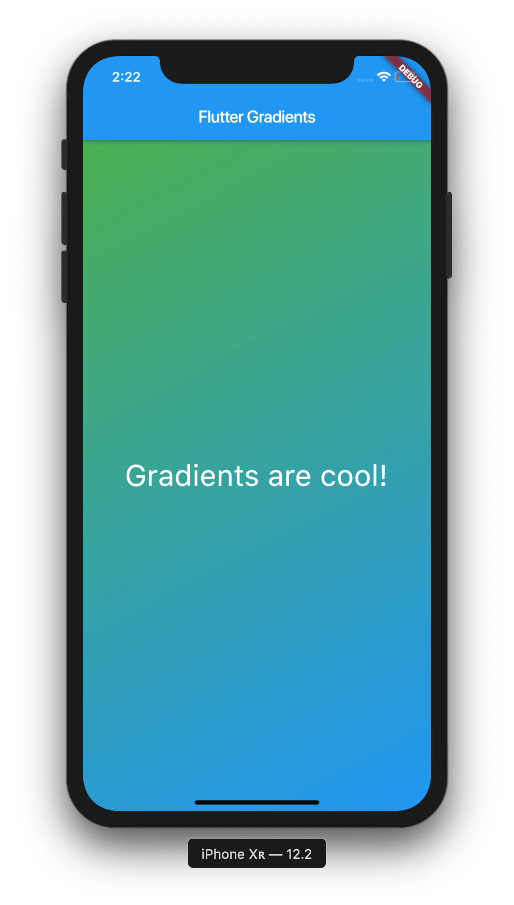
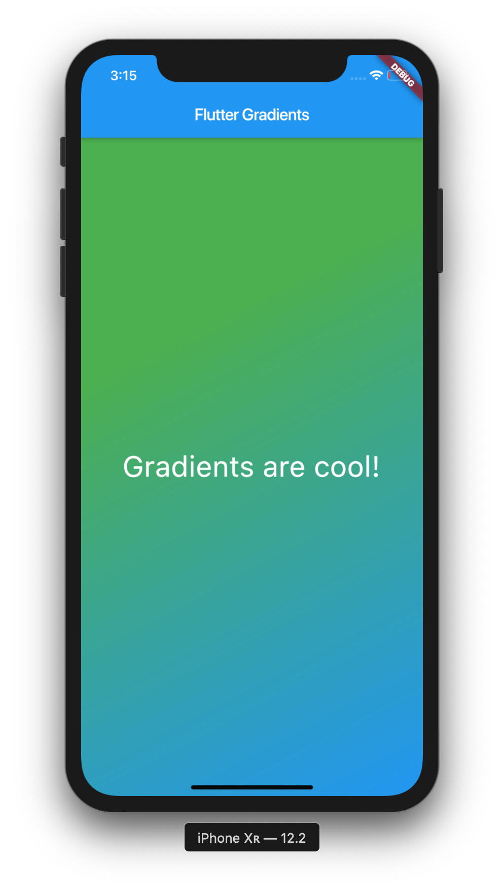

<div id="codefund"><!-- fallback content --></div>
<script src="https://codefund.io/properties/311/funder.js" async="async"></script>

In this post we'll be covering how to use gradients within Flutter. Gradients can make an application look beautiful, and they're simpler than ever to use in Flutter.

>If you aren't familiar with Flutter, then you can check out my Introduction to Flutter post [here](https://owenhalliday.co.uk/introduction-to-flutter/).

## Project Setup

Okay, let's get to using some gradients! Start off by creating a new Flutter project:

```bash
# Create a new Flutter project
$ flutter create gradients && cd gradients

# Open project in VS Code
$ code .

```

Now, let's use this code to start off our application:

```dart
import 'package:flutter/material.dart';

void main() => runApp(HomePage());

class HomePage extends StatelessWidget {
  @override
  Widget build(BuildContext context) {
    return MaterialApp(
      title: 'Flutter Gradients',
      home: Scaffold(
        appBar: AppBar(
          title: Text('Flutter Gradients'),
        ),
        body: Container(
          child: Center(
            child: Text('Gradients are cool!',
              style: TextStyle(
                fontSize: 35,
                color: Colors.white,
              ),
            ),
          ),
        ),
      ),
    );
  }
}
```

As you can see, we've got a `Container`, with a `Center` and `Text` widget, along with a little styling. We've also got an `AppBar` with a `title`.

## Assigning a BoxDecoration

To use gradients within Flutter, we need to access the `decoration` property inside of our `Container` widget, and then assign a `BoxDecoration`. Lets do that:

```dart
body: Container(
  decoration: BoxDecoration(
  ),
  child: Center(
    child: Text('Gradients are cool!',
      style: TextStyle(
        fontSize: 35
      ),
    ),
  ),
),
```

Good. From now, we can actually start creating our gradient. In Flutter, there are three types of gradients, a **linear gradient**, a **radial gradient** and a **sweep gradient**. In this post, we'll be exploring all three.

## Creating a LinearGradient

First of all, let's implement a linear gradient into our application:

```dart
body: Container(
  decoration: BoxDecoration(
    gradient: LinearGradient(
      colors: [Colors.green, Colors.blue])
  ),
  child: Center(
    child: Text('Gradients are cool!',
      style: TextStyle(
        fontSize: 35,
        color: Colors.white,
      ),
    ),
  ),
),
```

Inside of our `BoxDecoration`, we've added a `gradient` property, which gives us the ability to use the `LinearGradient` widget. Inside of our `LinearGradient` widget we've added the property of `colors`, which we've made blue and green. Let's have a look at what that gives us:


Great! We now have a linear gradient that goes from green to blue. Our app is already starting to look more beautiful. Let's begin to explore some properties that we can assign to our `LinearGradient` in order to change its appearance.

Firstly, we can change where the gradient stops and starts by adding the `begin` and `end` properties. Let's see if we can make our gradient go from the top left, to the bottom right of the screen.

```dart
body: Container(
  decoration: BoxDecoration(
    gradient: LinearGradient(
      begin: Alignment.topLeft,
      end: Alignment.bottomRight,
      colors: [Colors.green, Colors.blue])
  ),
  child: Center(
    child: Text('Gradients are cool!',
      style: TextStyle(
        fontSize: 35,
        color: Colors.white,
      ),
    ),
  ),
),
```

As you can see, we've added the properties of `begin` and `end` with values of `Alignment.topLeft` and `Alignment.bottomRight`. This should change how the gradient is aligned. Let's have a look at our application now:



Much better. Now we have a gradient that is properly aligned, and looks great.

We can also determine the fractions along the gradient by using the `stops` property. To do that we need to assign a list of values from 0.0 to 1.0. Let's try that out:

```dart
body: Container(
  decoration: BoxDecoration(
    gradient: LinearGradient(
      begin: Alignment.topLeft,
      end: Alignment.bottomRight,
      stops: [0.3, 1],
      colors: [Colors.green, Colors.blue])
  ),
  child: Center(
    child: Text('Gradients are cool!',
      style: TextStyle(
        fontSize: 35,
        color: Colors.white,
      ),
    ),
  ),
),
```

This value that has been assigned to the `stops` property should push the green part of our gradient closer to the bottom right of the screen. Let's have a look at our app:



As you can see, the fraction of our gradient has been pushed further down the bottom right of the screen. If we increase the value of the `stops` property, the fraction would be pushed further down, so on and so forth.

We can also increase the amount of colours in our gradient, so let's do that:

```

```

Next up we're going to explore how to use **radial gradients** in Flutter.

## Radial Gradients