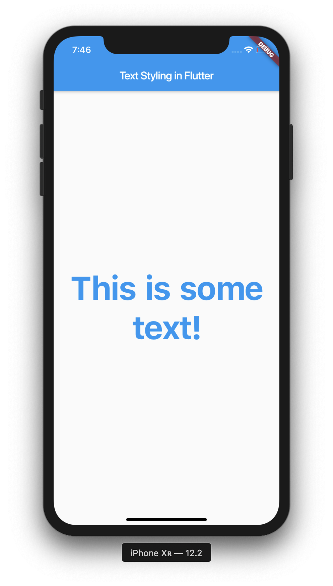
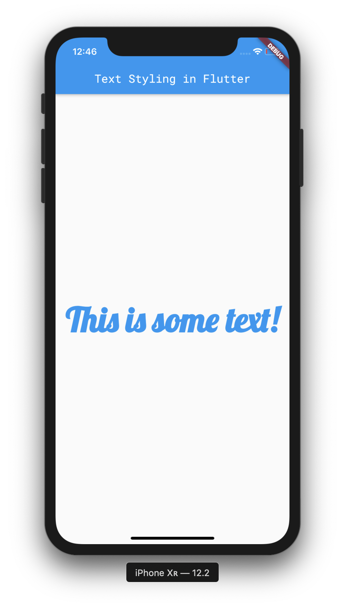

Text is a massive part of any mobile application, so making sure it looks great and is easy to read is essential. In this guide I'm going to be covering methods in which text can be styled in Flutter. This includes using custom fonts, sizing, fontWeight, global theming and more. 

>If you aren't familiar with Flutter, then you can check out my Introduction to Flutter post [here](https://owenhalliday.co.uk/introduction-to-flutter/).

# Project Setup

Okay, let's get started! Create a new Flutter project:

```bash
# Create a new Flutter project
$ flutter create text_styling && cd text_styling

# Open project in VS Code
$ code .

```

Now, let's create a new `MaterialApp` inside of `main.dart` so we can start playing around.

```dart
import 'package:flutter/material.dart';

void main() => runApp(MyApp());

class MyApp extends StatelessWidget {
  @override
  Widget build(BuildContext context) {
    return MaterialApp(
      title: 'Text Styling in Flutter',
      home: Scaffold(
        appBar: AppBar(
          title: Text('Text Styling in Flutter'),
        ),
        body: Center(
          child: Text('This is some text!'),
        ),
      ),
    );
  }
}

```

We should be seeing something like this:


As we can see, we've got an `AppBar` with a title, and a `Text` widget which is centered in the middle of the screen.   Now let's move onto styling our `Text` widget.

## Text Properties

Inside of our application, we're going to be supplying our `Text` widget with a `TextStyle`. This allows us to assign a number of properties, including `fontSize`, `fontWeight` and `color`. Let's assign those properties to our `Text` widget:


```dart
body: Center(
    child: Text('This is some text!', 
    style: TextStyle(
      fontSize: 60.0,
      fontWeight: FontWeight.bold,
      color: Colors.blue
      ))
   ),
```

Our application should look like this:


Hmm, something doesn't seem right. Our text is the correct size, but it isn't centered. Let's fix that by adding the `textAlign` property to our `Text` widget, and then giving it a value of `TextAlign.center`.

```dart
body: Center(
    child: Text('This is some text!',
    textAlign: TextAlign.center,
    style: TextStyle(
    fontSize: 60.0,
    fontWeight: FontWeight.bold,
    color: Colors.blue,
    ))
),
```

Now let's see what that gives us:



Great! Our text is starting to look more stylish now. Let's begin to explore some properties more in-depth.

## fontWeight property

The `fontWeight` property can be supplied with multiple values using the `fontWeight` constants. Not only can you supply values such as `bold` and `normal`, you can actually supply a custom `fontWeight` by using `FontWeight.w[weightValue]`, ranging from 100 (thinnest) to 900 (extra bold).

## Custom Fonts

Now we've created our `Text` Widget and applied a `TextStyle`, let's explore **custom fonts**. Even though Android and iOS provide very high quality fonts, you may be required to use a custom font in your application. For instance, you might need to use a custom-made font from a designer, or even a font from Google Fonts. We'll be going through how to apply fonts across an entire Flutter Application and to specific widgets.

### Adding a new Font

To add a new custom font to your app, create a `fonts` folder at the root of your application, like so:


To work with our fonts, we're going to have to import the font files into our project. I'm going to be using Roboto Mono, but you can use any font that you may like!

Place your font files inside of the `fonts` folder you just created. Next up, we're going to have to declare our new custom font inside of our `pubspec.yaml`, so our Flutter application knows where to find it. For instance:

``` yaml
# Replace Roboto Mono and assets with your chosen font

 fonts:
     - family: Roboto Mono
       fonts:
         - asset: fonts/RobotoMono-Regular.ttf
         - asset: fonts/RobotoMono-Bold.ttf
           weight: 700
```

### Setting A Default Custom Font

We have two options when applying fonts to text within Flutter. We can either set a font as the default throughout an applicaiton, or we can apply a font to a specific `Text` widget.

To set a font as the default, we will need to set the `fontFamily` property as part of our app's `theme`. The value of the `fontFamily` property must be the same as the `family` name of the font that we declared inside of `pubspec.yaml`.

```dart
return MaterialApp(
      title: 'Text Styling in Flutter',
      theme: ThemeData(fontFamily: 'Roboto Mono'),
      home: Scaffold(
        appBar: AppBar(
          title: Text('Text Styling in Flutter'),
        ),
        body: Center(
          child: Text('This is some text!',
          textAlign: TextAlign.center,
          style: TextStyle(
            fontSize: 60.0,
            fontWeight: FontWeight.bold,
            color: Colors.blue,
          ))
        ),
      ),
    );
```

Now, if we restart our application entirely, we should see that our custom font has been applied:


Great! Our text is starting to look better now.

### Widget Specific Custom Fonts

Now, what if you want to apply your font to the `Text` widget inside of your application, but don't want to apply it elsewhere, such as your `appBar`? This is where widget specific fonts can come in handy. We can actually apply a custom font to the `Text` widget inside of our `TextStyle` class, like so:

```dart
return MaterialApp(
      title: 'Text Styling in Flutter',
      theme: ThemeData(fontFamily: 'Roboto Mono'),
      home: Scaffold(
        appBar: AppBar(
          title: Text('Text Styling in Flutter'),
        ),
        body: Center(
          child: Text('This is some text!',
          textAlign: TextAlign.center,    
          style: TextStyle(
            fontSize: 60.0,
            fontWeight: FontWeight.bold,
            color: Colors.blue,
            fontFamily: 'Lobster'
          ))
        ),
      ),
    );
```

Let's see what that now gives us:



Awesome. We've now assigned our `Text` widget a specific font, seperate from the rest of the application.

---

I hope you've learned a lot throughout this post, be sure to subscribe to keep up-to-date with any future Flutter content!

>The source code for this project can be found here:
>[https://github.com/ohalliday/text-styling-flutter](https://github.com/ohalliday/text-styling-flutter)